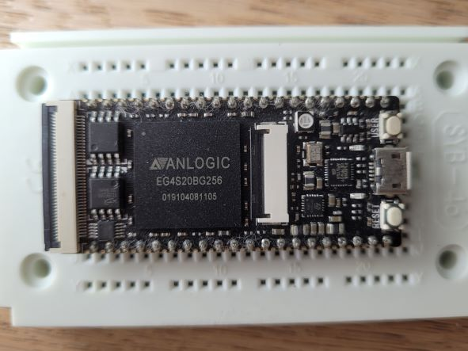
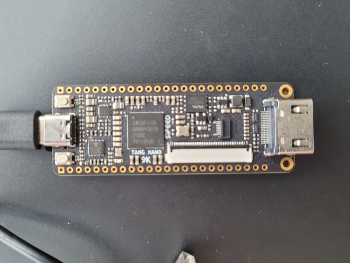
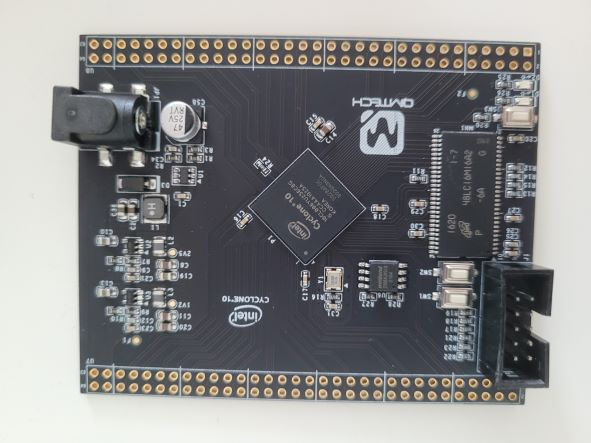

## fpga boards

| fpga              | Board name | company | board image | notes | repos |
|-------------------|------------|:--------:|:------------:|-----|-------|
| [CycloneIV	EP4CE10](https://www.aliexpress.com/item/32812945851.html?spm=a2g0o.order_list.0.0.21ef1802oBoC0a) | "zeowaa" | altera   |  | LEDs(8), Buttons(2), Reset(1), EPCS16 |
| [CycloneIV EP4CE15](https://github.com/bbttko/CYCLONE_IV_STARTER_KIT) | qmtech Cyclone4 starter kit | altera   |  | GMII ethernet, VGA 565, Winbond 32MB SDRAM, SPI flash 8Mbytes, CP2102 UART, Button(1), Reset(1), 7-Seg (3), Leds(2) |
| [Max10 10M02SCM153](https://github.com/bbttko/STEP-MAX10)| StepFPGA | altera |  | on-board USB blaster, 7-seg (2), RGB Leds(2), LEDs(8), Switches(4), Buttons(4) |
| [Anlogic EG4S20](https://github.com/bbttko/Tang_FPGA_Examples)| sipeed Tang Primer | anlogic |  | 64Mbit SDRAM (built-in), 8Mbit Flash, on-board JTAG debugger, TF card, Button(1), Reset(1), RGB LED(1), FPC40P ZIF (display), FPC24P ZIP (camera) |
| [Gowin GW1NR-9](https://github.com/sipeed/TangNano-9K-example) | sipeed Tang Nano 9K | gowin |  | 32Mbit SPI Flash, HDMI, SPI ZIF (display), RGB ZIF (display), onboard JTAG, USB-C uart, Button(2), LED(6) | PicoRV - [PicoRV-TangNano9K](https://github.com/bbttko/PicoRV-TangNano9K) using LCD Led - [Tang9k-lcdled](https://github.com/bbttko/Tang9k-lcdled) SDCard - [Tang9k-sdcard-test](https://github.com/bbttko/Tang9k-sdcard-test) |
| [Cyclone10 10CL006](https://github.com/bbttko/QM_Cyclone10_10CL006) | qmtech | altera |  | Micron 32MB SDRAM, 8MByte SPI Flash |

## board images

### <u>zeowaa board</u>
 
 - ep4ce10
 - 8x LEDs
 - 2x buttons, 1x reset button
 - EPCS16

### <u>Cyclone4 starter kit</u>
\ 
 - ep4ce15
 - ethernet GMII
 - VGA 565
 - Winbond 32MB SDRAM, SPI flash 8MBytes
 - serial port CP2102
 - 1x button, 1x reset
 - 7-segment display (3)
 - 2x LEDs

### <u>Max10 Step10</u> 
PicoRV - [PicoRV-StepFPGA](https://github.com/bbttko/PicoRV-StepFPGA) 
 
 - Max10 10M08SAM
 - on board USB blaster
 - 7-segment (2x)
 - 2x RGB leds / 8x LEDs
 - 4x switches / 4x buttons 

### <u>Anlogic TangPrimer</u> 
 
 - Anlgic EG4S20 (SDRAM 64Mbit built-in)
 - on board JTAG, download debugger
 - TF card socket
 - 1x button, 1x reset, 1x RGB LED
 - Flash 8Mbit
 - FPC40P ZIF socket (display)
 - FPC24P ZIF socket (camera)

### <u>Gowin TangNano9k</u> 
PicoRV - [PicoRV-TangNano9K](https://github.com/bbttko/PicoRV-TangNano9K) 
using LCD Led - [Tang9k-lcdled](https://github.com/bbttko/Tang9k-lcdled) 
SDCard - [Tang9k-sdcard-test](https://github.com/bbttko/Tang9k-sdcard-test) 
 
 - Gowin GW1NR-9
 - 32Mbit SPI flash
 - HDMI connector
 - SPI LCD ZIF (display)
 - RGB LCD ZIF (display)
 - onboard JTAG, USB-C, & usb-uart
 - 2x button, 6x LEDs 

### <u>Cyclone10 QMTech</u> 	
 
 - Cyclone10 10CL006
 - SPI flash 8MBytes
 - Micron 32MB SDRAM