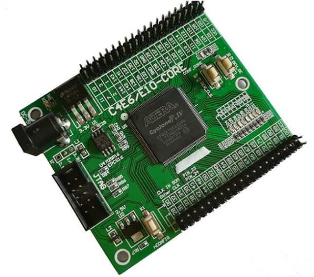
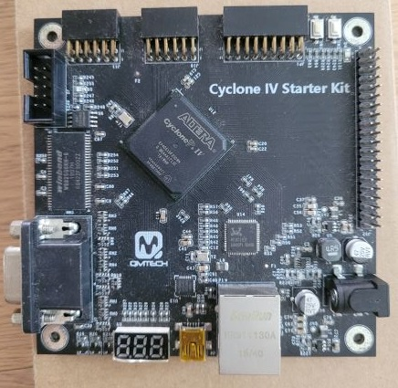
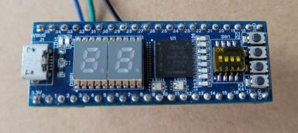
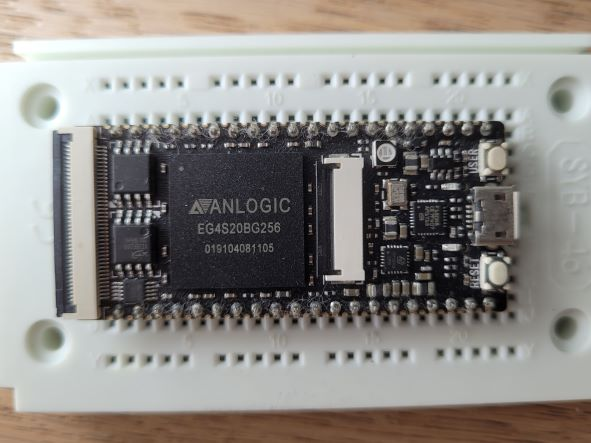
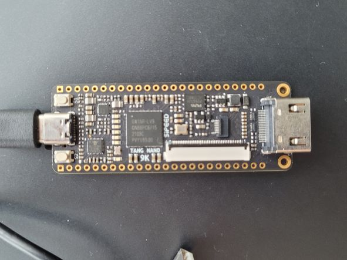
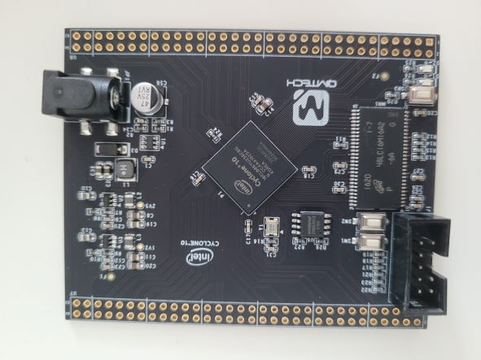

[//]: <> (reference https://www.markdownguide.org/basic-syntax/)

## boards

| fpga              | board name | company | board image | notes | repos |
|-------------------|------------|:--------:|:------------:|-----|-------|
| [CycloneIV EP4CE10](https://www.aliexpress.com/item/32812945851.html?spm=a2g0o.order_list.0.0.21ef1802oBoC0a) | _zeowaa_ |    |  | LEDs(8) Buttons(2) Reset(1) EPCS16 |
| [CycloneIV EP4CE15](https://github.com/bbttko/CYCLONE_IV_STARTER_KIT) | QMtech Cyclone4 starter kit |    |  | GMII ethernet VGA 565 Winbond 32MB SDRAM SPI flash 8Mbytes CP2102 UART Button(1) Reset(1) 7-Seg (3) Leds(2) | ⛔[PicoRV + Qsys](https://github.com/bbttko/PicoRV-Cyclone4-Qsys)
| [Max10 10M02SCM153](https://github.com/bbttko/STEP-MAX10)| StepFPGA |  |  | on-board USB blaster 7-seg (2) RGB Leds(2) LEDs(8) Switches(4) Buttons(4) |
| [Anlogic EG4S20](https://github.com/bbttko/Tang_FPGA_Examples)| sipeed Tang Primer |  |  | 64Mbit SDRAM (built-in) 8Mbit Flash on-board JTAG debugger TF card Button(1) Reset(1) RGB LED(1) FPC40P ZIF (display) FPC24P ZIP (camera) |
| [Gowin GW1NR-9](https://github.com/sipeed/TangNano-9K-example) | sipeed Tang Nano 9K |  |  | 32Mbit SPI Flash HDMI SPI ZIF (display) RGB ZIF (display) onboard JTAG USB-C uart Button(2) LED(6) | PicoRV - [PicoRV-TangNano9K](https://github.com/bbttko/PicoRV-TangNano9K) using LCD Led - [Tang9k-lcdled](https://github.com/bbttko/Tang9k-lcdled) SDCard - [Tang9k-sdcard-test](https://github.com/bbttko/Tang9k-sdcard-test) |
| [Cyclone10 10CL006](https://github.com/bbttko/QM_Cyclone10_10CL006) | qmtech |  |  | Micron 32MB SDRAM 8MByte SPI Flash |

